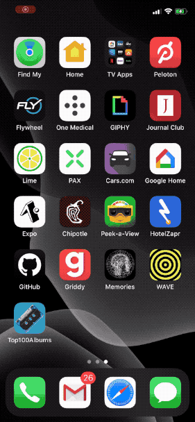

# Top100Albums
Simple App to Display the top 100 albums across all genres from iTunes `https://rss.itunes.apple.com/en-us`

This project is also implemented using [UITableViewDiffableDataSource](https://developer.apple.com/documentation/uikit/uitableviewdiffabledatasource) if you're interested in that checkout [this branch](https://github.com/dtroupe18/Top100Albums/tree/diffableDataSource) or more specifically this [viewController](https://github.com/dtroupe18/Top100Albums/blob/diffableDataSource/Top100Albums/UI/Screens/TopAlbums/TopAlbumsViewController.swift).

## Setup Repo

1. `git clone git@github.com:dtroupe18/Top100Albums.git`.
2. `cd Top100Albums`.
3. `open -a "/Applications/Xcode.app" *.xcworkspace`.
4. Sign with your certificate.
5. Run.

## Sample Screenshots

Light was dark mode was handled automatically using [system colors](https://developer.apple.com/design/human-interface-guidelines/ios/visual-design/color).

## Sample Video

## Architecture

Top100 Albums is an [MVVM](https://en.wikipedia.org/wiki/Model%E2%80%93view%E2%80%93viewmodel) app that follows the [coordinator](https://benoitpasquier.com/coordinator-pattern-swift/) pattern.

## Cocoapods

Cocoapods were added to version control so you shouldn't need to install them. 

Pods:

1. [Alamofire](https://github.com/Alamofire/Alamofire)
2. [CocoaLumberjack](https://github.com/CocoaLumberjack/CocoaLumberjack)
3. [DeviceKit](https://github.com/devicekit/DeviceKit)
4. [KingFisher](https://github.com/onevcat/Kingfisher)
5. [PromiseKit](https://github.com/mxcl/PromiseKit)
6. [SnapKit](https://github.com/SnapKit/SnapKit)
7. [SwiftFormat](https://github.com/nicklockwood/SwiftFormat)
8. [SwiftLint](https://github.com/realm/SwiftLint)

Testing Pods:

1. [OHHTTPStubs](https://github.com/AliSoftware/OHHTTPStubs)
2. [SnapshotTesting](https://github.com/pointfreeco/swift-snapshot-testing)

## Snapshot Testing

1. Run tests using the `iPhone 8` simulator iOS 14.
2. The version of iOS on the simulator can cause snapshot tests to fail. 
