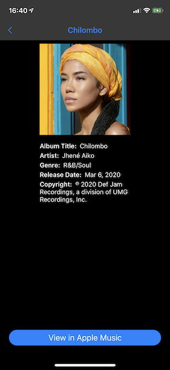

# Top100Albums
Simple App to Display the top 100 albums across all genres from iTunes `https://rss.itunes.apple.com/en-us`

## Setup Repo

1. `git clone git@github.com:dtroupe18/Top100Albums.git`.
2. open `Top100Albums.xcworkspace`.

## Sample Screenshots

Light was dark mode was handled automatically using [system colors](https://developer.apple.com/design/human-interface-guidelines/ios/visual-design/color).

## Sample Video

## Architecture

Top100 Albums is an [MVVM](https://en.wikipedia.org/wiki/Model%E2%80%93view%E2%80%93viewmodel) app that follows the [coordinator](https://benoitpasquier.com/coordinator-pattern-swift/) pattern.

## Cocoapods

Cocoapods were added to version control so you should need to install them. 

Pods used:

1. [CocoaLumberjack](https://github.com/CocoaLumberjack/CocoaLumberjack)
2. [KingFisher](https://github.com/onevcat/Kingfisher)
3. [SnapKit](https://github.com/SnapKit/SnapKit)
4. [SwiftLint](https://github.com/realm/SwiftLint)
5. [OHHTTPStubs](https://github.com/AliSoftware/OHHTTPStubs)
6. [SnapshotTesting](https://github.com/pointfreeco/swift-snapshot-testing)

## Snapshot Testing

Run tests using the `iPhone 8` simulator.
